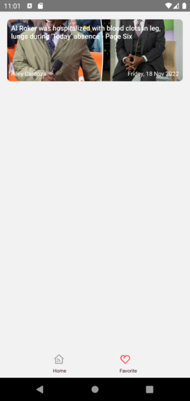

## Form Login using Formik and Yup

# News App

Simple news app using react native 

## API 
Using api from [news.api.org](https://newsapi.org/)

## Library Used 
1. react-native-mmkv
2. axios
3. react-query
4. lodash
5. react-native-element

## Installation 
1. Clone the project
2. Update the news api key with your key in file env.json
3. Install the library 
4. Run the project

## Screenshots

